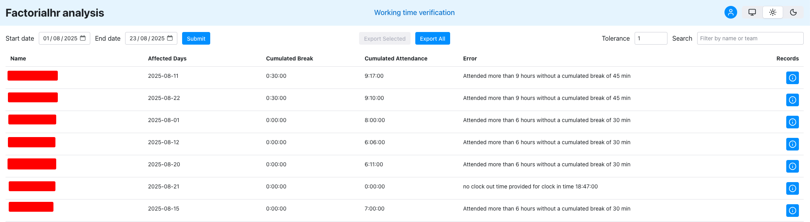

# FactorialHR work time verification

    

This script verifies attendances whether they comply with german law. In particular, the following rules are verified:
- Whether the work time is longer than 6 hours without a break of 30 min
- Whether the work time is longer than 9 hours without a break of 45 min
- Whether the work time is longer than 10 hours without a break of 11 hours
- Whether the work time is within the time of 6am and 10pm

## Disclaimer

I do not guarantee that this package complies with german law all the time. Changes may occur anytime. Use at your own risk.

Errors where the time attended is 1 min above the limit are ignored, because factorial's automated time tracking is not precises enough.

## Usage

- clone this repository
- install dependencies using `uv sync --frozen`
- copy [`.env.sample`](.env.sample) to `.env` and adjust the environment variables
- run app `uv run reflex run --env prod`

## Contributing

Feel free to contribute! Please fork this repository, install the development dependencies with `pip install -e ".[dev]"` and create pull request.
